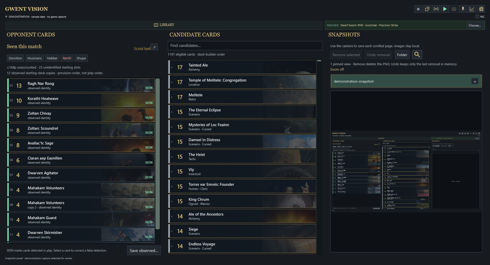
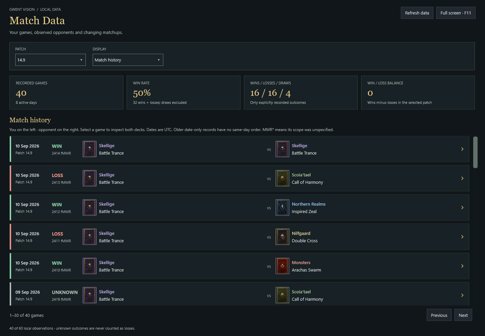
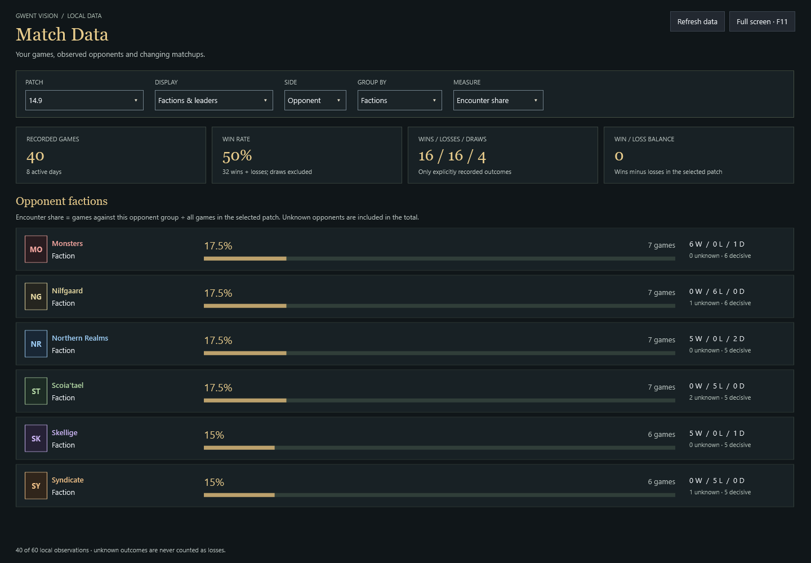
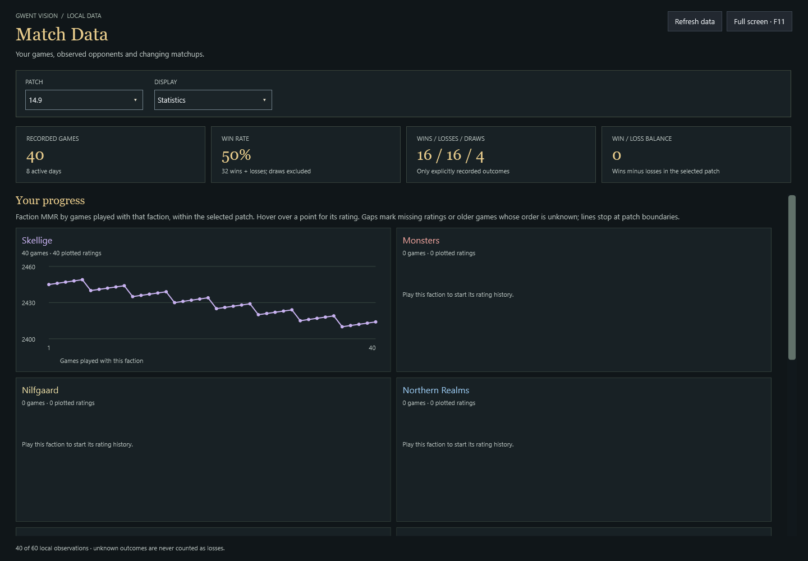

# Gwent Vision

Gwent Vision is a free, open-source Windows companion for *GWENT: The Witcher Card Game*. Version 0.3 records cards that are visibly played, keeps a persistent deck library, stores completed matches locally, and turns that history into useful matchup and MMR views.

It is an unofficial, not-for-profit fan project. Gwent Vision provides no predictive functionality.

[Download the latest Windows release](../../releases/latest) · [View public season MMR curves](https://amkokot.github.io/GwentVision/) · [Open the interface tour](docs/SCREENSHOTS.md) · [Report a bug](../../issues/new?template=bug_report.yml) · [Request a feature](../../issues/new?template=feature_request.yml)

## Live tracking

The **Opponent Cards** view records cards seen on the visible game screen. Generated cards and other provenance are retained separately so that a spawned or created card is not silently counted as a starting-deck copy. The Candidates view provides a searchable card catalogue in normal deck-builder order.

In the wide layout, Opponent Cards, Candidates, and Snapshots appear in three columns. Compact mode shows the same tools one at a time beside a windowed game. The selected player deck shares the Library row in wide mode, so it remains obvious without taking space from opponent cards.



## Match Data

Every completed match is saved locally with its date, patch, result, round scores, confirmed rating when available, player deck, and observed opponent cards. Match Data opens in its own resizable or full-screen window and defaults to the latest saved patch.

- **Match history** shows wins in green and losses in red with both factions and leader abilities. Expanding a row places the saved player deck beside the opponent list; seen and inferred cards share one list while keeping their evidence badge and fade.
- **Factions and leaders** compares encounter share or win rate for either side of the matchup.
- **Your progress** plots faction MMR by games played and presents review priorities based on gameplay results.







Players below Pro Rank do not have faction MMR, so those matches remain in history and matchup summaries while rating charts leave the unavailable rating blank.

## Deck library, snapshots, and recording

The Library stores any number of decks and supports search, filters, close variations, manual building, deck-builder scans, PlayGWENT links, and spreadsheet imports. The deck selected as **Deck you are playing** is saved as the authoritative player list in subsequent match records. User data is kept outside the replaceable application directory so updates preserve the library, settings, installation identity, and upload receipts.


Snapshots keep selected game screens available for quick review. Optional diagnostic recording can reproduce recognition defects. Snapshots and recordings remain local unless the user deliberately shares a sanitized example.

## Optional data contribution

On first ordinary startup, Gwent Vision asks whether the user wants to contribute match data for Balance Council recommendations. A manual **Push to database** button can be used repeatedly; signed, revision-aware uploads send only new or corrected completed matches from the current patch. Users can also choose one automatic contribution on the first match played after the 18th of each month.

The contribution service is configured in the release, so users do not need a Supabase account, API key, or setup step. The raw research data is pseudonymous, is not published, and is available only to individually approved analysts. It excludes player names, Gwent account identifiers, screenshots, and recordings. Read the [data contribution and privacy policy](docs/DATA-CONTRIBUTION-PRIVACY.md) for the exact fields, retention limits, deletion controls, and source categories.

Anonymous public MMR curves are a separate setting, enabled by default. A successful push returns a season code that can highlight that installation's curve on the [public season site](https://amkokot.github.io/GwentVision/). The public feed contains only a per-season curve identity, rounded time buckets, faction, metric, rating, and point order. It contains no decks, opponents, match IDs, installation IDs, or exact timestamps.

The site provides:

- total MMR as a strictly increasing running sum of the best rating seen in up to four factions, with unplayed factions contributing zero;
- one-faction and all-faction individual MMR curves; and
- privacy-thresholded daily faction match share and win rate.

## Install

1. Open the [latest release](../../releases/latest) and download `GwentVision-Windows-x64.zip`.
2. Extract the ZIP contents into the GWENT installation folder, beside `Gwent.exe`.
3. Launch **Gwent Vision.cmd** from that folder. It is a portable shortcut to the app inside `GwentVision`. You can also run `GwentVision\GwentVision.exe` directly.
4. Start GWENT, then press the play button in Gwent Vision when you want live recognition to begin.

The installed layout is:

```text
GWENT The Witcher Card Game\
├── Gwent.exe
├── Gwent Vision.cmd
└── GwentVision\
    ├── GwentVision.exe
    ├── cache\
    └── vision-assets\
```

Gwent Vision supports Windows 10 or later and ships as a self-contained x64 build. For reliable recognition, use a 16:9 GWENT resolution such as 1280×720, 1920×1080, or 3840×2160. Clearly letterboxed displays are normalized automatically.

## How recognition works

Gwent Vision reads ordinary Windows desktop pixels from the visible game window. All displayed information comes from that screen, and recognition begins only when the user presses the play button.

## Contributing

You do not need to be a programmer to help. A short description of a missed card or awkward workflow is useful. Please remove names, profile identifiers, local paths, and private deck information from screenshots before attaching them to an issue.

- [Report a bug](../../issues/new?template=bug_report.yml)
- [Request a feature](../../issues/new?template=feature_request.yml)
- [Browse the issue tracker](../../issues)

Code and detector contributors should start with [CONTRIBUTING.md](CONTRIBUTING.md). The [architecture notes](docs/ARCHITECTURE.md), [local match format](docs/LOCAL-MATCH-DATA.md), and [database runbook](docs/DATABASE-SETUP-RUNBOOK.md) describe the main components and release process.

```powershell
dotnet build GwentCompanion.sln -c Release
dotnet run --project tests/GwentCompanion.Tests/GwentCompanion.Tests.csproj -c Release -- --recording-validation-regression
dotnet run --project tests/GwentCompanion.Tests/GwentCompanion.Tests.csproj -c Release -- --contributor-validation-regression
```

GitHub repeats these checks for pull requests, validates the public export for private files and secrets, and performs a ClamAV scan before release.

## License and attribution

Gwent Vision is not affiliated with or endorsed by CD PROJEKT RED. Game names, artwork, and other game assets belong to their respective owners. Code is available under the [MIT License](LICENSE); third-party material is excluded from that grant as described in [THIRD_PARTY_NOTICES.md](THIRD_PARTY_NOTICES.md).
