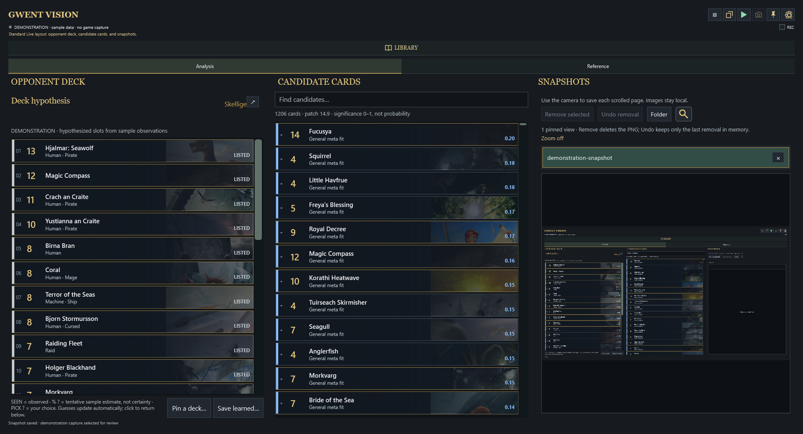
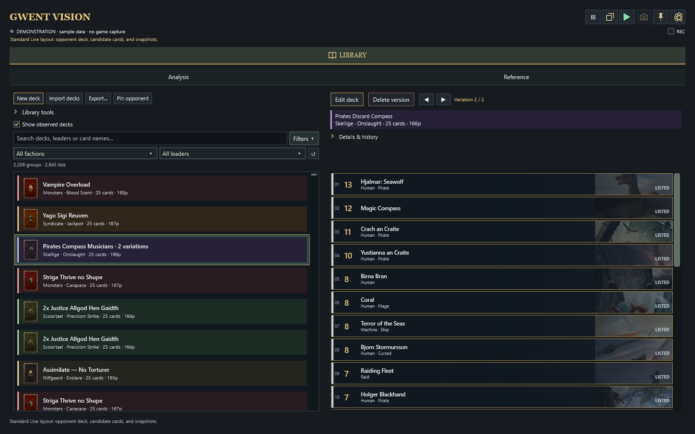
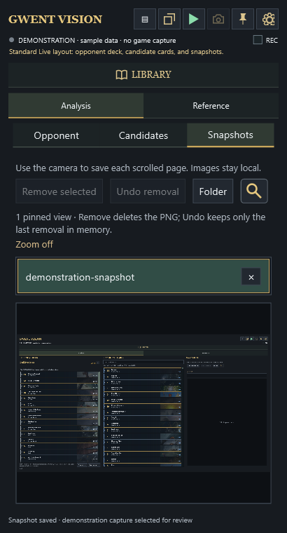
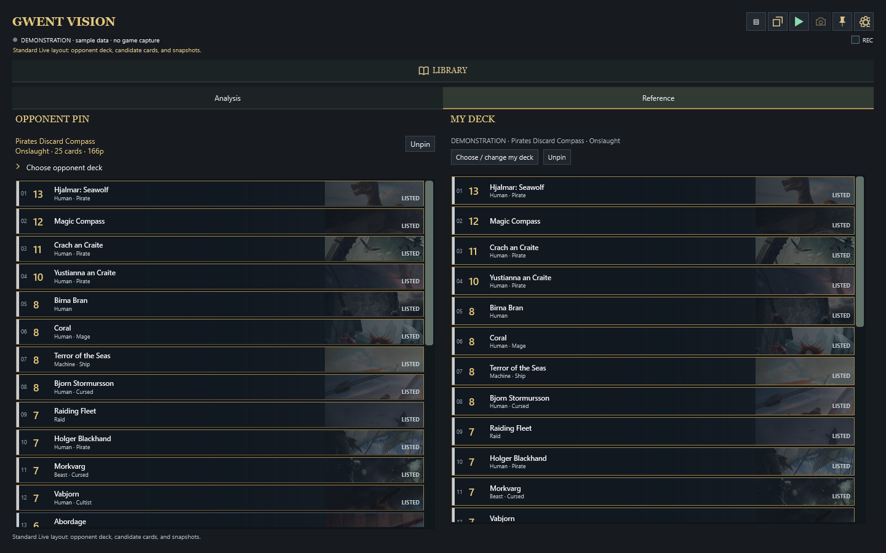

# Gwent Vision

Gwent Vision is a free, open-source Windows companion for *GWENT: The Witcher Card Game*. It runs alongside GWENT, uses computer vision to record cards played by an opponent, and turns those observations into a possible deck composition. It also includes snapshots, optional recording, and an extended deck library.

This is an unofficial, not-for-profit fan project made for the community. It is not a bot and provides no means to automate the game.

[Download the latest Windows release](../../releases/latest) · [Open the complete interface tour](docs/SCREENSHOTS.md) · [Report a bug](../../issues/new?template=bug_report.yml) · [Request a feature](../../issues/new?template=feature_request.yml)

## Interface tour

The easiest way to understand Gwent Vision is to see how its tools fit together. In full-screen mode, the main in-game display contains the opponent's hypothesized deck, other highly correlated candidate cards, and a snapshot utility for keeping tabs on useful information.



*Full-screen Live view: hypothesized opponent deck on the left, candidate cards in the center, and pinned snapshots on the right.*

The same tools can be displayed as a single column alongside a windowed GWENT game for users without a second monitor. The original combined analysis layout remains available as an opt-in experimental view in Settings.

## Features

### Extended Library

Outside of games, the Library is one of the most useful parts of Gwent Vision. There is no limit on the number of decks you can store, and they can be searched, filtered, grouped into related variants, and compared with ease.



Deck information can be pulled from individual PlayGWENT links or spreadsheets of links and cached directly in the Library. If you are working from the in-game deck builder, a screen scan can move that deck into Gwent Vision.

A deck stored in Gwent Vision can also be prepared as a PlayGWENT link on the user's account and then imported into GWENT. This makes it possible to handle deck building outside the game and leaves room for community-driven quality-of-life improvements.

### Snapshots and Recording

The rightmost panel in the Live view takes fresh screen captures during a game. This is useful for keeping track of information involving cards such as Maxii or Vial of Forbidden Knowledge without leaving the main analysis display.



*Snapshot history and the selected image remain together for quick review.*

Optional recording can capture games for personal review or help reproduce recognition bugs. Recordings remain local unless the user deliberately shares them. Any evidence submitted publicly must first have names and other identifying information removed.

### Deck Recognition

As cards are played, Gwent Vision builds a record of the cards observed in the opponent's deck and uses that information to estimate the remaining composition. The user can refine the result by selecting likely cards from the candidate pool or by pinning an exact opponent list from the Library.



*Reference mode compares observed cards with a selected opponent deck.*

After a game, an opponent deck composition can be stored locally for later reference and used to improve future predictions.

## Install

1. Open the [latest release](../../releases/latest) and download `GwentVision-Windows-x64.zip`.
2. Extract the ZIP while keeping its `GwentVision` folder intact.
3. Move that folder into the GWENT installation folder, beside `Gwent.exe`.
4. Run `GwentVision.exe` from inside the extracted folder.
5. Start GWENT, then click Play in Gwent Vision when you want live recognition to begin.

The resulting layout should resemble:

```text
GWENT The Witcher Card Game\
├── Gwent.exe
└── GwentVision\
    ├── GwentVision.exe
    ├── cache\
    └── vision-assets\
```

Gwent Vision supports Windows 10 or later and is released as a self-contained x64 build.

## Compatibility and current testing

For reliable recognition, use a 16:9 GWENT resolution, such as 1280×720, 1920×1080, or 3840×2160. Clearly letterboxed displays are normalized automatically. If an unfamiliar aspect ratio cannot be mapped safely, recognition pauses rather than updating the deck from uncertain screen regions.

Battlefield cosmetics do not require separate configuration because card identity is matched from visible card artwork rather than the board texture. Hands-on testing has primarily used one Windows laptop and the default battlefield. The automated validation suite covers resolution bounds, dark and textured backgrounds, letterboxing, and fail-closed handling for unknown layouts, but reports from other hardware, scaling settings, resolutions, and battlefield cosmetics are especially useful.

## Project boundaries

Gwent Vision is intended to display information that comes from the visible game screen. It does not access private game state, automate input or gameplay, or recommend a best move or line of play. Recognition is inactive until the user starts it.

## How to help

You do not need to be a programmer to help. A short description of something that did not work—or an idea that would make the app more useful—is valuable:

- [Report a bug](../../issues/new?template=bug_report.yml)
- [Request a feature](../../issues/new?template=feature_request.yml)
- [Browse the issue tracker](../../issues)

For code, detector, test, or documentation contributions, start with [CONTRIBUTING.md](CONTRIBUTING.md). The [implementation notes](docs/ARCHITECTURE.md) describe the main components and data flow.

Every proposed change must build successfully and pass the relevant public validation checks:

```powershell
dotnet build GwentCompanion.sln -c Release
dotnet run --project tests/GwentCompanion.Tests/GwentCompanion.Tests.csproj -c Release -- --recording-validation-regression
dotnet run --project tests/GwentCompanion.Tests/GwentCompanion.Tests.csproj -c Release -- --contributor-validation-regression
```

Contributors add the expected behavior and test evidence for their own changes. After a case is committed, the validation runners discover it automatically. GitHub repeats these checks for pull requests and performs a ClamAV malware sweep before release. Detector evidence must be reviewed and anonymized; the full workflow and privacy rules are in the contributor guide.

## Open directions

There is plenty of room for further development, including:

- localization for additional languages;
- improved detection across cards, screens, resolutions, and display scaling;
- more anonymized validation examples from varied hardware and battlefield cosmetics;
- clearer opponent-deck hypotheses and explanations of uncertain candidates;
- lower capture, recognition, and rendering overhead; and
- smoother installation, updating, accessibility, and first-run guidance.

## License and attribution

Gwent Vision is not affiliated with or endorsed by CD PROJEKT RED. Game names, artwork, and other game assets belong to their respective owners. Code is available under the [MIT License](LICENSE); third-party material is excluded from that grant as described in [THIRD_PARTY_NOTICES.md](THIRD_PARTY_NOTICES.md).
