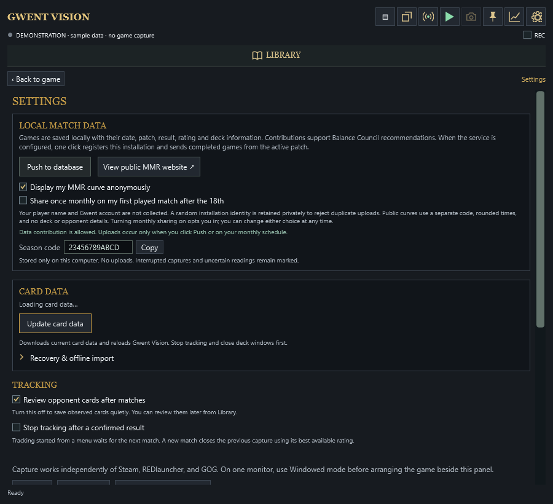

# Interface tour

These screens use sample matches and public deck data. They contain no player identity or private deck library.

## Opponent Cards

The wide live layout shows detected opponent cards, the searchable card list, and saved snapshots in three columns. The card list follows the usual deck-builder order. Compact mode shows the same three views one at a time beside a windowed game.

## Match history

Match Data initially shows games from the latest saved patch. History includes the result, both factions and leaders, date, round score, and faction MMR. Selecting a match shows your complete saved deck on the left and the opponent deck information on the right. Labels and a slight fade distinguish detected cards from estimated cards.

## Faction and leader matchups

The middle Match Data display shows either how often each faction or leader appears or the win rate for that matchup. It can summarize the opponent's side or the decks you played. Factions with no games remain visible.

## MMR progress and review priorities

The statistics display plots each faction's MMR against the number of games played with that faction during the selected patch. A gap appears when the game did not show a clear MMR value. The remaining statistics focus on gameplay results and useful areas to review.

## Deck library

The extended Library groups similar versions of a deck, displays cards in deck-builder order, and clearly marks the deck you are currently playing. It includes search, filters, manual editing, PlayGWENT link imports, spreadsheet imports, and scans from the in-game deck builder.

## Data sharing settings

Settings contains the manual database push, the choice to display an anonymous MMR curve, the monthly sharing option, your season code, and a direct link to the public MMR site. A short message explains data sharing the first time the app opens, with complete details available under **More details** and in the privacy policy.

## Snapshot review

The snapshot view keeps capture history and the selected image together. The camera button captures a fresh frame; images remain local.

