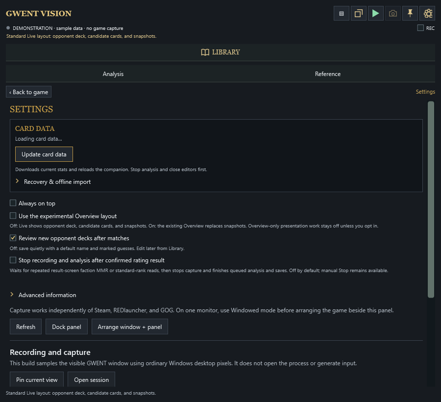
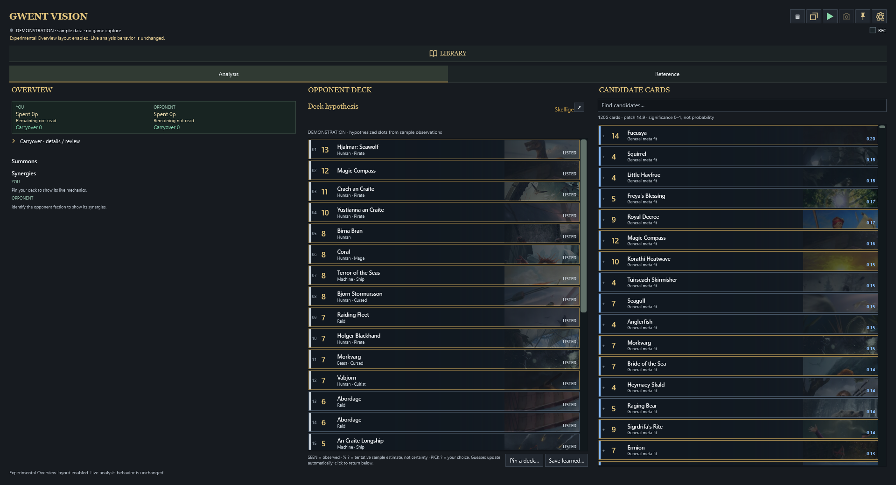

# Interface tour

These screens use the offline demonstration fixture and public deck data. No game capture or personal library is shown.

## Live analysis

The default wide layout puts the hypothesized opponent deck first, highly correlated candidate cards in the middle, and saved snapshots on the right. The same tools can be displayed as a single column beside a windowed GWENT game.

## Snapshot review

The compact snapshot view keeps capture history and the selected image together. This can preserve information from cards such as Maxii or Vial of Forbidden Knowledge while play continues. The camera button takes a fresh frame rather than saving an old preview.

## Deck library

The Library groups close variants and shows the selected list beside its cards. It supports search and filtering, PlayGWENT links and link spreadsheets, deck-builder scanning, and preparation of a PlayGWENT link for importing a stored deck into GWENT.

## Opponent reference

Reference mode compares the observed opponent cards with a pinned reference deck. This gives the user an exact list to consult when a statistical hypothesis is not the preferred view.

## Settings

Settings include the explicit switch for the experimental Overview layout.

## Experimental Overview

When enabled, the former Overview, opponent deck, and candidate layout replaces the default Live panes.

